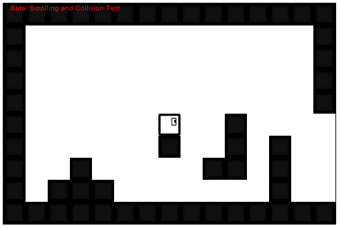

<h1>Block Run Beta</h1>

<a href="https://rawgit.com/SpencerWie/JavaScript/master/Block%20Run/blockRun.html"> Click here to play the lastest version of the game</a>

The original game <em>Block Run</em>, was created as a simple platform game in Python (using pyGame). It was the first "real" game that I've created, because of this things were not done in the most effiecent way. Now I'm doing a new and improved <em>Block Run</em> written in JavaScript using the HTML5 Canvas. 

<h3>How to Play:</h3>
<ul>
	<li><em><strong>Left/Right Arrow keys:</strong></em> Moves player left and right.</li>
	<li><em><strong>Up Arrow key:</strong></em> Jump.</li>
	<li><em><strong>Down Arrow key:</strong></em> Duck.</li>
	<li><em><strong>Shift (Hold):</strong></em> Sprint.</li>
	<li><em><strong>Space:</strong></em> Move to next level (<em>must be inside an end of level portal</em>).</li>
</ul>

<h3>Current Version: <strong><em>v0.43</em></strong></h3>
<ul>
  <li>Added Platforms</li>
  <li>Added Ghost Block (<em>Gets more transpart with distance</em>)</li>
  <li>New Enemy: <strong>Spike</strong></li>
  <li>Stage 4 (currently in development)</li>
  <li>Fixed Bugs: <em>Ducking casuing a blinking animation stall has been fixed</em></li>
</ul>

<h3><em>v0.40</em></h3>
<ul>
  <li>Added Locks and Keys.</li>
  <li>Portal functionality implemented</li>
  <li>3rd level added to height level system</li>
  <li>Added Spikes</li>
  <li>Player death system improved</li>
  <li>Added player ducking ability</li>
  <li>Added player running animation</li>
  <li>Balanaced Levels, improved resolution</li>
  <li>Stage 2 and 3 is complete</li>
</ul>

<h3><em>v0.30</em></h3>
<ul>
  <li>Improved Performance</li>
  <li>Added coins</li>
  <li>Added Sky and Ground Backgrounds</li>
  <li>Height 2 Level system implemented</li>
  <li>Added Sprinting</li>
  <li>Added level map system (<em>Portal Sprites</em>)</li>
  <li>Added Hearts</li>
  <li>Player now dies when hit by an enemy (basic death system).</li>
</ul>

<h3><em>v0.20</em></h3>
<ul>
  <li>Tilemap System added</li>
  <li>Platform collision added/fixed</li>
  <li>Added/fixed Scrolling</li>
  <li>Improved Graphics</li>
  <li>Added Animation</li>
  <li>Added basic enemy</li>
  <li>Stage 1 is complete</li>
</ul>

<h3>Planned Updates: <em>v0.4x</em></h3>
<ul>
	<li>New Enemies</li>
	<li>More Levels</li>
	<li>New Tiles</li>
	<li>Menu System</li>
</ul>

<h5>Notice</h5>

This game and graphics were created by me. Therefore you may not steal my graphics or game and claim it as your own. If you do wish to use any of my graphics please contact me on doing so; I will simply ask you to give me credit on the used graphics.

