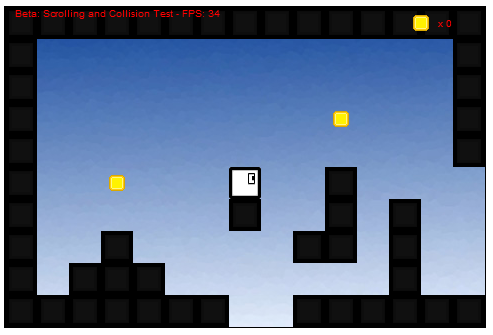

<h1>Block Run Beta</h1>

<a href="http://cs.iupui.edu/~spdwiecz/JavaScript/Block%20Run/blockRun.html"> Click here to play the lastest version of the game

The original game <em>Block Run</em>, was created as a simple platform game in Python (using pyGame). It was the first "real" game that I've created, because of this things were not done in the most effiecent way. Now I'm doing a new and improved <em>Block Run</em> written in JavaScript using the HTML5 Canvas. 

<h3>Current Version: v0.21</h3>
<ul>
  <li>Tilemap System added</li>
  <li>Platform collision added/fixed</li>
  <li>Added/fixed Scrolling</li>
  <li>Improved Graphics</li>
  <li>Added Aniamtion</li>
</ul>

<h5>Notice</h5>

This game and graphics were created by me. Therefore you may not steal my graphics or game and claim it as your own. If you do wish to use any of my graphics please contact me on doing so; I will simply ask you to give me credit on the used graphics.

