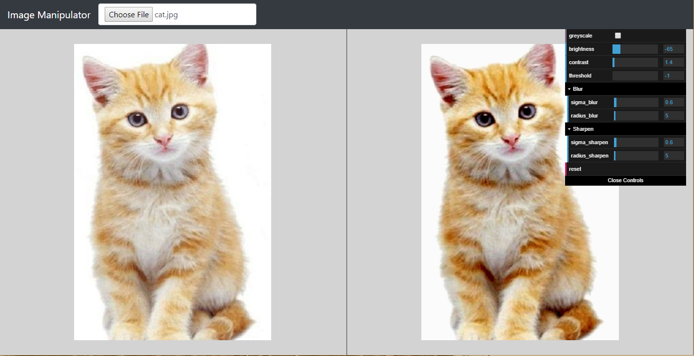
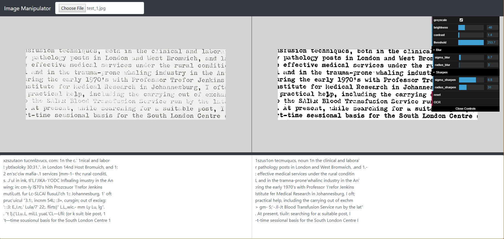

## Image Manipulator

Image manipulation tool with side-by-side copmarison and real-time updates. A user can pan and zoom either image and it will be applied to both images for easy comparisons. The left image is the oringal user provided image, the right is the manipulated image.

[**Click here to run the latest version of Image Manipulator**](https://rawgit.com/SpencerWie/JavaScript/master/ImageManipulator/index.html)

### Version 0.3

### How to use:

Click on *"Choose File"* and select an image from your computer, it will be added into the left image element. Currently there are four operations that can be done using the editor:

* **Greyscale**: Checking this will greyscale the image
* **Brightness**: The user can change the brightness of the image from -100 to 100, this is the added value on the pixel data
* **Contrast**: The user can change the brightness of the image from -100 to 100, this is the mulitplied value on the pixel data
* **Blur**: The user can blur the image by sigma/raduis amount, applying a guassain blur.
* **Sharpen**: Will apply a blur and subtract that from the oringal image, creating a sharpened image.
* **OCR**: Will OCR both images and display the result as text in the bottom window.
* **Reset**: Will reset the image operations back to default along with the pan and zoom.

### OCR

Tesseract is used as an OCR for a pratical use case for image maniluation, which can improve text extraction. To do this click the *"OCR"* button and open the bottom window (*mouse mouse to the bar on the bottom and click and drag it up*), the textarea will turn grey to signify it's being processed on when complete will turn back to white with the results.

Below is an example where deceases brightness mixed with increases contrast, along with a slight blur and a applied sharpening. Then a high image thresolding to make nearly any  to further force the image text to black, shows improved text extraction results:

### Libraries Used:

* [opencv.js](https://docs.opencv.org/3.3.1/df/d0a/tutorial_js_intro.html) - Libary used for image manipulations.
* [dat.GUI](https://github.com/dataarts/dat.gui) - The GUI interface libary for image manipulation parameters.
* [jQuery](https://jquery.com/) / [jQuery PanZoom](https://github.com/timmywil/jquery.panzoom) - Libary used for help with pan and zoom operations
* [Tesseract.js](https://github.com/naptha/tesseract.js) - Used for image OCR into text.
* [Bootstrap 4](https://getbootstrap.com/) - Used for consitence page styling and look across broswers (*Modifed to fix visual issue it creates on dat.GUI*)
